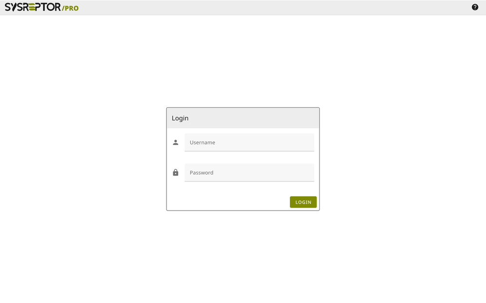

# Hack The Box Reporting

Our free cloud service to write your Hack The Box CPTS, CWES, CDSA, CWEE, CAPE, CJCA or CWPE reports.

💲 Free.  
💎 Including Pro features.  
✍️ Write it in Markdown.  
📄 Render the report for your certifiation.  
👌 Zero setup required.  

<br>

<br><div style="text-align:center">[:rocket: Sign Up (it's free)](https://htb.sysreptor.com/htb/signup/){ .md-button }</div>
<br><div style="text-align:center">Already have an account? [Login here.](https://labs.sysre.pt){ target=_blank }</div>
<br>

## Prefer self-hosting?
1. [Install](setup/installation.md){ target="_blank" } SysReptor
2. Import all HTB Designs and Reports:

```shell
cd sysreptor/deploy
curl -s "https://docs.sysreptor.com/assets/htb-designs.tar.gz" | docker compose exec --no-TTY app python3 manage.py importdemodata --type=design
curl -s "https://docs.sysreptor.com/assets/htb-demo-projects.tar.gz" | docker compose exec --no-TTY app python3 manage.py importdemodata --type=project
```

<br><br>

## Hack The Box Reports
<div style="text-align:center">
<a href="/assets/reports/HTB-CPTS-Report.pdf" target="_blank">
    <figure style="float:left;width:24%;margin:0.5em;">
        
        <figcaption>HTB CPTS Report Demo</figcaption>
    </figure>
</a>
<a href="/assets/reports/HTB-CWES-Report.pdf" target="_blank">
    <figure style="float:left;width:24%;margin:0.5em;">
        
        <figcaption>HTB CWES Report Demo</figcaption>
    </figure>
</a>
<a href="/assets/reports/HTB-CDSA-Report.pdf" target="_blank">
    <figure style="float:left;width:24%;margin:0.5em;">
        
        <figcaption>HTB CDSA Report Demo</figcaption>
    </figure>
</a>
<a href="/assets/reports/HTB-CWEE-Report.pdf" target="_blank">
    <figure style="float:left;width:24%;margin:0.5em;">
        
        <figcaption>HTB CWEE Report Demo</figcaption>
    </figure>
</a>
<a href="/assets/reports/HTB-CAPE-Report.pdf" target="_blank">
    <figure style="float:left;width:24%;margin:0.5em;">
        
        <figcaption>HTB CAPE Report Demo</figcaption>
    </figure>
</a>
<a href="/assets/reports/HTB-CJCA-Report.pdf" target="_blank">
    <figure style="float:left;width:24%;margin:0.5em;">
        
        <figcaption>HTB CJCA Report Demo</figcaption>
    </figure>
</a>
<a href="/assets/reports/HTB-CWPE-Report.pdf" target="_blank">
    <figure style="float:left;width:24%;margin:0.5em;">
        
        <figcaption>HTB CWPE Report Demo</figcaption>
    </figure>
</a>
</div>
<br style="clear:both" />

## Creating HTB Report
<figure markdown>
  
</figure>

