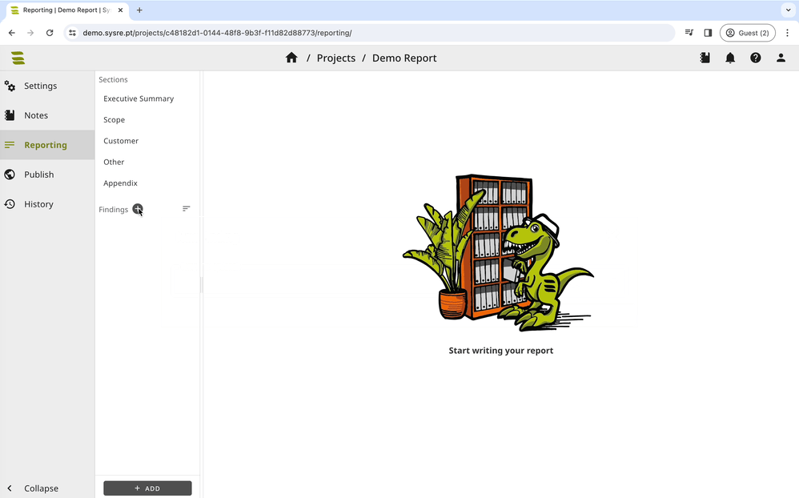
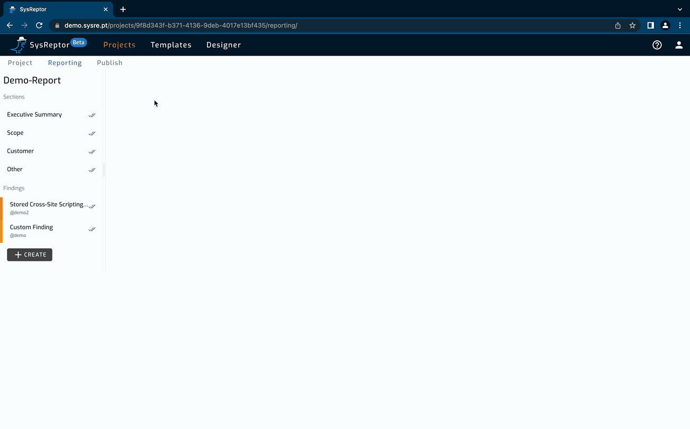

  

    

      <h1 style="color: white; font-weight: bold; font-size: 3em">BLACK FRIDAY -30%</h1>
      
Code: <strong>BLACKFRIDAY2025</strong>

      
Valid for new customers.

      
      <a class="black-friday-button" style="text-align:center; margin-top:1.5em;" href="https://portal.sysreptor.com/order/" target="_blank">Order Now</a>
      

      
      
    

    

      
  </img>
    

  

<!--
<h1 style="text-align: center;font-weight:bold;">Pentest Reports Easy As Pie.</h1>

  
  </img>

-->

-   __Customize Reports__

    
    </img>

    Design in HTML.

    As easy as falling off a log.

-   __Write Reports__

    
    </img>

    Write in Markdown.

    It gives you an easy ride.

-   __Render and Download__

    
    </img>
 
    Render to PDF.

    Easier done than said.

-   __Operate Platform__

    
    </img>

    Self-Hosted or Cloud.

    Easy peasy lemon squeezy.

 
[:fire: Get Started](setup/installation.md){ .md-button target="_blank" }

 
[:sauropod: Book a Demo](https://outlook.office365.com/book/SysReptorDemo@syslifters.com/s/gUjy2xF2GEeSc_6mDLvvkA2){ .md-button target="_blank" }

 
<figure markdown>
  
  <figcaption>Create finding from template</figcaption>
</figure>

<figure markdown>
  
  <figcaption>Export report as PDF</figcaption>
</figure>
