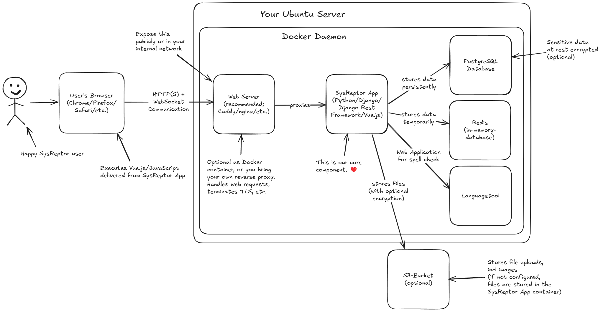

# SysReptor Architecture
This is a short explanation of the SysReptor architecture in self-hosted environments.  

## Overview

## The Happy SysReptor User
The happy SysReptor user accesses SysReptor with a browser. The user is so happy because pentest reporting is now more convenient.

## The Web Browser
Web browser should be up to date. We officially support Chrome, Firefox, Safari and Edge.
The browser displays the web contents and executes JavaScript and Vue.js code delivered from the SysReptor app.

Communications happens via the HTTP(S) protocol and via WebSockets.

## The Server
An Ubunutu server with preinstalled Docker v2 incl. the Docker Compose plugin is a prerequisiste of running SysReptor.  
It might be possible to use different Operating Systems or Distributions, which is, however, not officially supported.

## The Web Server
The web server is responsible for handling web requests and for proxying the requests to the SysReptor App server.  
We recommend setting up TLS for encrypted communication.

Our [setup script](../setup/installation.md#easy-script-installation) offers the possibility to spin up a Caddy web server as reverse proxy, which also handles TLS certificates, incl. renewals. You can, however, also use reverse proxies that already exist in your infrastructure. They must be able to handle WebSocket communications.

## The SysReptor App
This is our core component that we actively develop and maintain. It is a Python/Django application and uses the Django Rest Framework (DRF) as server technology, and Vue.js with Vuetify as client/frontend technology. The SysReptor app handles the application logic, permissions, data handling, etc. In self-hosted installations, it also does the PDF rendering jobs that [render data to PDF](../insights/rendering-workflow.md). For this, it uses a headless Chromium browser for rendering the final HTML and [Weasyprint](https://weasyprint.org/){target=_blank} for converting the HTML to PDF.

## The Database
SysReptor uses a PostgreSQL database for storing data persistently. The SysReptor app optionally holds a secret which is used to store sensitive data in encrypted form.  
If encryption is enabled, you must have the secret to be able to restore data from the database.

## Redis
SysReptor uses the in-memory database Redis for temporarily storing information. This is (among others) necessary for synchronizing activities between users during report writing, allowing for example collaborative editing.  
Data stored in Redis is mostly indexes and references and is not encypted.

## Languagetool
SysReptor Professional users can use the integrated spell check. This requires the [languagetool](https://languagetool.org/){target=_blank} container which provides a web API to receive text and to suggest improvements. Data received by languagetool in unencrypted and stored in memory and/or local caches.

## The S3 Bucket
Users can upload images to reports and any filetypes to notes. Those files are by default stored in the SysReptor app container.
If encryption is enabled, all files are encrypted.

You can optionally configure SysReptor to use an S3 bucket for storing files. If encryption is enabled, the S3 bucket provider has no access to file contents. (When enabling encryption you must run `docker compose run --rm app python3 manage.py encryptdata` from the `deploy` directory to force encryption of stored but unencrypted data.)  
You must have the secret to recover encrypted files from your S3 bucket.

## What about the Cloud?
This was an overview of the self-hosted SysReptor architecture.
In our Cloud service, we use the same components, but maintain them in a Kubernetes cluster in which every customer receives a dedicated namespaces.

The database server is shared among the customers, but separated using dedicated users and databases for each customer.  
Files are stored on an internal hosted S3 bucket. The SysReptor apps can only access their own files using temporary S3 keys with permissions restricted to their customer files.  
PDF rendering is performed by a pool of rendering workers. The rendering worker pool is shared among all customers, but after each PDF render the worker job is shut down and replaced with a fresh worker instance. Rendering worker instances are never reused to render reports of different customers.
