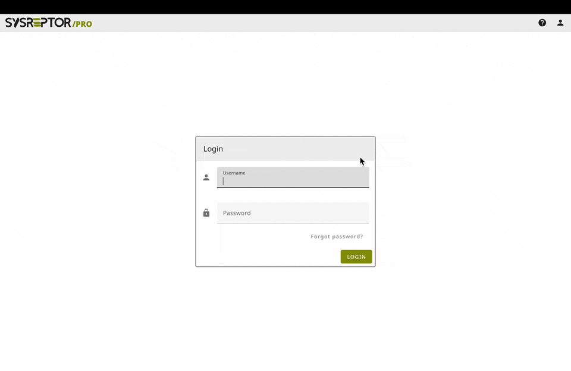

# OffSec Reporting

Our free cloud service to write your OffSec OSCP+, OSEP, OSWP, OSWA, OSWE, OSED, OSMR, OSEE, OSDA, OSIR, OSTH reports.

💲 Free.  
💎 Including Pro features.  
✍️ Write it in Markdown.  
📄 Render the report for your certifiation.  
👌 Zero setup required.  


<br><div style="text-align:center">[:rocket: Sign Up (it's free)](https://offsec.sysreptor.com/oscp/signup/){ .md-button }</div>
<br><div style="text-align:center">Already have an account? [Login here.](https://labs.sysre.pt){ target=_blank }</div>
<br>

## Prefer self-hosting?
1. [Install](setup/installation.md){ target="_blank" } SysReptor
2. Import all OffSec Designs:

```shell
cd sysreptor/deploy
url="https://docs.sysreptor.com/assets/offsec-designs.tar.gz"
curl -s "$url" | docker compose exec --no-TTY app python3 manage.py importdemodata --type=design
```

<br><br>

## OffSec Reports
### Penetration Testing
<div style="text-align:center">
<a href="/assets/reports/OffSec-OSCP-Exam-Report.pdf" target="_blank">
    <figure style="float:left;width:24%;margin:0.5em;">
        
        <figcaption>OffSec OSCP+ Exam Report Demo</figcaption>
    </figure>
</a>
<a href="/assets/reports/OffSec-OSWP-Exam-Report.pdf" target="_blank">
    <figure style="float:left;width:24%;margin:0.5em;">
        
        <figcaption>OffSec OSWP Exam Report Demo</figcaption>
    </figure>
</a>
<a href="/assets/reports/OffSec-OSEP-Exam-Report.pdf" target="_blank">
    <figure style="float:left;width:24%;margin:0.5em;">
        
        <figcaption>OffSec OSEP Exam Report Demo</figcaption>
    </figure>
</a>
</div>
<br style="clear:both" />

### Web Application Security
<div style="text-align:center">
<a href="/assets/reports/OffSec-OSWA-Exam-Report.pdf" target="_blank">
    <figure style="float:left;width:24%;margin:0.5em;">
        
        <figcaption>OffSec OSWA Exam Report Demo</figcaption>
    </figure>
</a>
<a href="/assets/reports/OffSec-OSWE-Exam-Report.pdf" target="_blank">
    <figure style="float:left;width:24%;margin:0.5em;">
        
        <figcaption>OffSec OSWE Exam Report Demo</figcaption>
    </figure>
</a>
</div>
<br style="clear:both" />

### Exploit Development
<div style="text-align:center">
<a href="/assets/reports/OffSec-OSED-Exam-Report.pdf" target="_blank">
    <figure style="float:left;width:24%;margin:0.5em;">
        
        <figcaption>OffSec OSED Exam Report Demo</figcaption>
    </figure>
</a>
<a href="/assets/reports/OffSec-OSMR-Exam-Report.pdf" target="_blank">
    <figure style="float:left;width:24%;margin:0.5em;">
        
        <figcaption>OffSec OSMR Exam Report Demo</figcaption>
    </figure>
</a>
<a href="/assets/reports/OffSec-OSEE-Exam-Report.pdf" target="_blank">
    <figure style="float:left;width:24%;margin:0.5em;">
        
        <figcaption>OffSec OSEE Exam Report Demo</figcaption>
    </figure>
</a>
</div>
<br style="clear:both" />

### Defensive Security
<div style="text-align:center">
<a href="/assets/reports/OffSec-OSDA-Exam-Report.pdf" target="_blank">
    <figure style="float:left;width:24%;margin:0.5em;">
        
        <figcaption>OffSec OSDA Exam Report Demo</figcaption>
    </figure>
</a>
<a href="/assets/reports/OffSec-OSIR-Exam-Report.pdf" target="_blank">
    <figure style="float:left;width:24%;margin:0.5em;">
        
        <figcaption>OffSec OSIR Exam Report Demo</figcaption>
    </figure>
</a>
<a href="/assets/reports/OffSec-OSTH-Exam-Report.pdf" target="_blank">
    <figure style="float:left;width:24%;margin:0.5em;">
        
        <figcaption>OffSec OSTH Exam Report Demo</figcaption>
    </figure>
</a>
</div>

<br style="clear:both" />
The structure follows the official OffSec reports (with kind permission by OffSec).

## Creating an OSCP Exam Report
<figure markdown>
  
</figure>

<br><div style="text-align:center">
    Not happy with our solution?<br><br>
    [:material-tools: Check out alternatives](oscp-reporting-tools.md){ .md-button target="_blank" }
</div>
