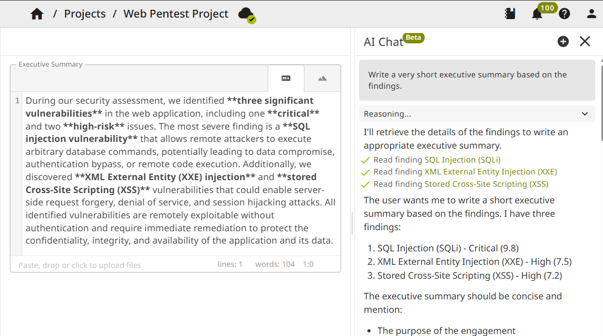

# AI Agent

The AI agent assists with pentest report writing and analysis. It can answer questions about your project, suggest and review content, create and edit findings and sections.

To be able to use the agent, enable it in applications settings and configure an LLM provider (see [configuration](/setup/configuration/#ai-agent)). Multiple LLM providers and also self-hosted models are supported.

The agent has access to project data through context and tools. It can read project structure, sections, findings, notes, and finding templates. The agent is scoped to the current project. It cannot access other projects.

## Agent Mode

- **Ask**: Read-only. The agent can view the project and answer questions or suggest text. It does not create or edit any data; you copy and apply suggestions yourself.
- **Agent** (:octicons-heart-fill-24: Pro only): Full write access. In addition to everything in Ask mode, the agent can create findings and update fields.

## Example Use Cases

- Generate executive summary from findings
- Generate finding recommendation from technical description
- Review texts for grammar and spelling
- Create findings from notes
- Analyze the report and ask questions about it
- and much more

