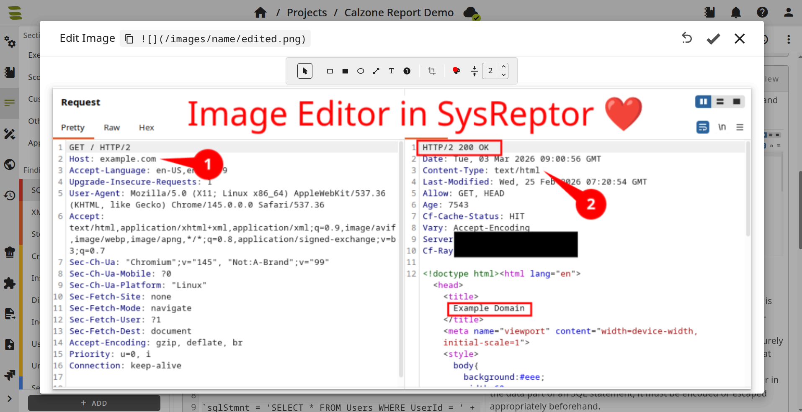

# Image Editor

The built-in image editor supports annotating and cropping images directly in the markdown editor. It can be used to highlight areas, add labels, crop screenshots, and redact sensitive information without leaving the report.

The editor can be opened from the markdown preview: click an image to open the image dialog, then select **Edit Image**.

The image editor supports the following annotations and tools:

* **Select:** Move, resize, or rotate objects.
* **Rectangle (outline)** / **Rectangle (filled):** Draw rectangles.
* **Ellipse:** Draw ellipses.
* **Line:** Draw straight lines.
* **Text:** Place editable text labels.
* **Numbered marker:** Place markers with numbers; drag the tip to point at regions.
* **Crop:** Define a region; switch to another tool to apply.
* **Color:** Set stroke and fill for new and selected shapes.
* **Stroke width:** Set line thickness and text size.

**Save** updates the image and the markdown reference. If the image was edited before, 
**Revert** restores the original. Color and stroke width are remembered for the next session.

The original image is kept internally to support Revert. It is not included in reports and is never exported; only the annotated/redacted image is included.

## Redacting images

Redaction is the removal or masking of sensitive information before an image is shared (e.g. passwords, API tokens, personal identifying information, etc.).

SysReptor offers multiple methods for redaction:

* **Pixelate**: Suitable for hiding details while keeping the screenshot visually consistent.
* **Filled rectangle**: Suitable for a clear, unambiguous mask, especially for highly sensitive text such as secrets, credentials, or tokens.
* **Crop**: Suitable when the sensitive area can be removed entirely without losing important context.

!!! info

    The pixelated region is generated without sampling any source pixels from inside the redacted area. Instead, synthetic pixels are derived from image content outside the selection (around redaction borders). As a result, the exported image contains no embedded data from the redacted area, and the original content cannot be recovered from the saved file.

