```mermaid caption="Organizational Structure" width="50%"
flowchart TD
  A[👔 CEO]
  A-->B[💻 CTO]
  A-->C[💰 CFO]
  A-->D[📈 COO]
```

# Markdown Features
The markdown syntax used in this project is based on the [CommonMark spec](https://spec.commonmark.org/){ target=_blank} with some extensions.

This document briefly describes the most important markdown syntax.
Non-standard markdown syntax is described more detailed.

## Common Markdown
~~~md
# Heading h1
## Heading h2
### Heading h3
#### Heading h4

Inline text styling: **bold**, _italic_, ~~strikethrough~~, `code`

Links: [Example Link](https://example.com)

* list
* items
    * nested list

1. numbered
2. list

```bash
echo "multiline code block";
# with syntax highlighting
```
~~~

## Underline
Underline is not supported in markdown. However you can insert HTML `<u>` tags to underline text.

```md
Text with <u>underlined</u> content.
```

## Images
Images use the standard markdown syntax, but are rendered as figures with captions.

```md
{width="50%"}


```

```html
<figure>
  
  <figcaption>Figure Caption</figcaption>
</figure>
```

## Footnotes
```md
Text text^[footnote content] text.
```

## Tables
For tables the GFM-like table syntax is used.
This syntax is extended to support table captions.

```md
| table   | header  |
| ------- | ------- |
| cell    | value   |

: table caption
```

Markdown tables are somewhat limited and do not support rowspans, colspans or multiline cell values. 
If you need one of these features, you can fall back to writing tables as [inline HTML](#inline-html).


## Code blocks
Code blocks allow including source code and highlight it.


The following example shows how to apply syntax highlighting to a HTTP request.
Many other programming languages are also supported.
````md
```http
POST /login.php HTTP/1.1
Host: sqli.example.com
Content-Type: application/x-www-form-urlencoded
Content-Length: 33

username='or'1'='1&password=dummy
```
````


Syntax highlighting is great for readability, but it only highlights predefined keywords of the specified language.
However, it does not allow to manually highlight certain text parts to draw the readers attention to it.

You can enable manual highlighting by adding code-block meta attribute `highlight-manual`. 
It is now possible to encapsulate highlighted areas with `§§highlighted content§§`.
In the rendered HTML code, the content inside the two `§§`-placeholders is wrapped by a HTML `<mark>` tag.
This works in combination with language-based syntax highlighting.

This example highlights the vulnerable POST-parameter `username` in the HTTP body.
````md
```http highlight-manual
POST /login.php HTTP/1.1
Host: sqli.example.com
Content-Type: application/x-www-form-urlencoded
Content-Length: 33

§§username='or'1'='1§§&password=dummy
```
````


If you need more advanced highlighting, you can place custom HTML code inside the `§§` placeholders e.g. `§<mark><strong><span class="custom-highlight">§Highlight this text.§§`.
If your code snippet includes `§`-characters, you cannot use them as escape characters for manual highlighting. 
It is possible to specify a different escaple character via the `highlight-manual="<escape-character>"` attribute.
Make sure that the escape character is not present in the code block.

The following example uses `"|"` as escape character and a custom HTML markup for highlighting.
````md
```http highlight-manual="|"
POST /login.php HTTP/1.1
Host: sqli.example.com
Content-Type: application/x-www-form-urlencoded
Content-Length: 33

|<mark><em><span class="custom-highlight">|username='or'1'='1|</span></em></mark>|&password=dummy
```
````

## Mermaid Diagrams
[Mermaid](https://mermaid.js.org/intro/) lets you create diagrams and visualizations using text and code. 
It is a JavaScript based diagramming and charting tool that renders Markdown-inspired text definitions to create and modify diagrams dynamically.

Mermaid diagrams are written in markdown code blocks with the language set to `mermaid`.
All diagram types supported by mermaid are avaialbe.
Diagrams will be rendered as HTML `<figure>` elements.
Like with images, you can set a caption and with/height.

The following example shows how to create a simple flowchart. 
````md

````

{width="50%"}


````md

````


## HTML Attributes
This extension allows you to set HTML attributes from markdown.
Place attributes in curly braces directly after the targeted element (without spaces between). 
Attributes are key value pairs (`attr-name="attr-value"`)
Shortcuts for setting the attribute `id` (`#id-value`) and `class` (`.class-value`) are supported.

```md
## Headline in Table of Contents {.in-toc .numbered}

{#img-id .image-class1 .image-class2 width="50%"}

Text with [styled link](https://example.com/){class="link-class" style="color: red"} in it.
```

## Inline HTML
If something is not possible with markdown, you can fall back to writing HTML code and embed it in the markdown document.


Following example shows a figure containing two images side-by-side.
```md
Text *with* **markdown** `code`.

<figure class="figure-side-by-side">
  
  
  <figcaption>Two images side-by-side</figcaption>
</figure>
```

It is also possible to embed markdown inside HTML blocks. An empty line is required as a seperator between HTML and markdown.
Following example shows a complex table that is not possible with the markdown table syntax.

```md
Text *with* **markdown** `code`.

<table>
  <thead>
    <th>Col1</th>
    <th>Col2<th>
  </thead>
  <tbody>
    <tr>
        <th colspan="2">Sub-header spanning two columns</th>
    </tr>
    <tr>
      <td>Cell 1</td>
      <td>

        This cell is rendered as markdown. You can use
        * `markdown` _elements_
        * such as **lists** for example
        * but make sure to seperate HTML and markdown blocks with an empty line
    
      </td>
    </tr>
  </tbody>
</table>
```

