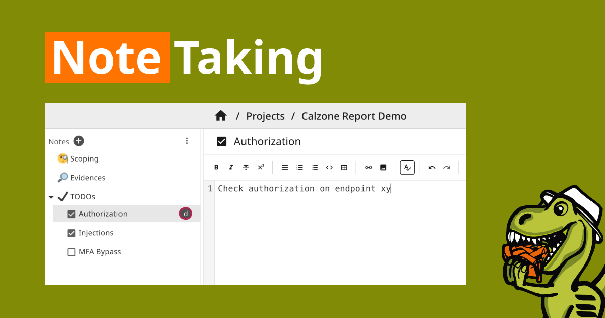
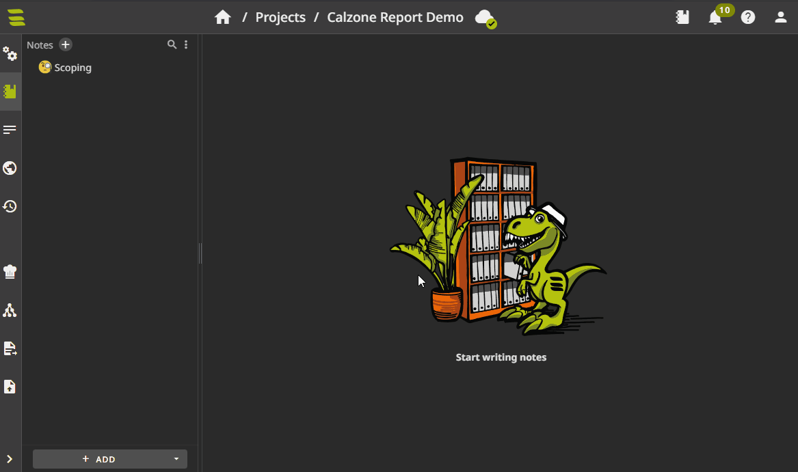
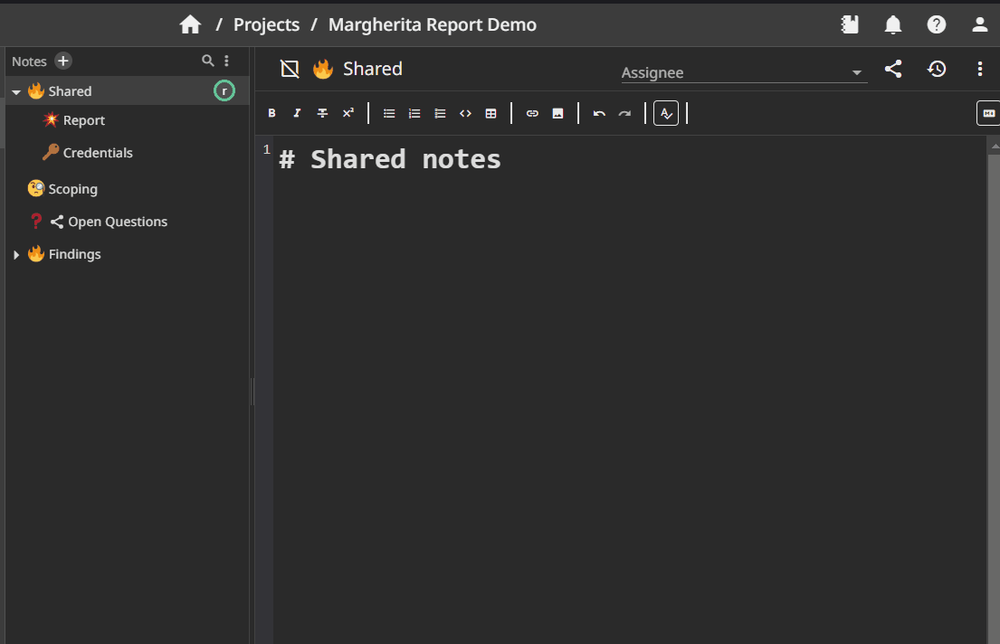

# Notes

Use **notes** as a scratchpad during an engagement: command output, screenshots, checklists, and anything else you do not want in the final PDF. You organize them in a free-form tree.

The **report** (sections and findings) is the structured deliverable. It follows the project design and is what you publish for the client.

SysReptor has two note areas:

* **Project notes**: accessible by all project members, follows the project life cycle
* **Personal notes**: accessible only by you

## Organizing notes

Drag notes in the sidebar to reorder them or move them under another note. Any note can have child notes.

Click the checkbox on a note to cycle through unchecked, checked, and emoji. On **project notes**, you can also set an assignee for ownership during the engagement.

Select one or more notes and use the menu in the sidebar to import, export, export as PDF, copy, or delete in bulk.

Project notes are included in [Version History](version-history.md). Personal notes are not.

## Note types

Pick a type from the **Add** menu when creating a note.

**Text notes** use the same markdown as [report fields](markdown-features.md). Paste images, upload files, and paste command output as you go.

**Excalidraw notes** open an embedded [Excalidraw](https://excalidraw.com/) canvas for diagrams and sketches.

## Collaborative editing
:octicons-heart-fill-24: Pro only

Several pentesters can edit the same note at once; changes sync in real time. See [Collaborative Editing](collaborative-editing.md).

## Sharing

Use the share button on a note to give someone without a SysReptor login access via a public link. The link includes that note and all of its children.

You can create multiple links per note. Each link has its own settings:

* **Password**: Optional. Visitors must enter the password in addition to opening the link.
* **Expire date**: The link expires after this date.
* **Read-only** or **read-write access**: When write access is enabled, visitors can edit note contents; otherwise the link is read-only.
* **Revoked**: Disable the link immediately without deleting it.
* **Comment**: Optional, internal comment about the share link to tell links apart and document with whom the link was shared.

On **Publish**, *Share by Link* generates the report PDF, creates a project note with the file attached, and opens the same sharing dialog so you can send the PDF to the client.

Instance administrators can turn off note sharing with `DISABLE_SHARING` in [Application Settings](../setup/configuration.md#application-settings) or `app.env`.

