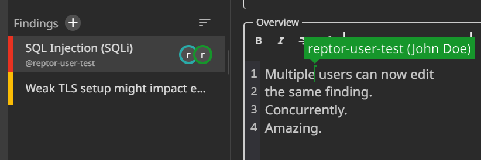

# Concurrent editing
Multiple pentesters can now edit one finding or section concurrently.

If you experience problems with WebSockets set the `ALLOWED_HOSTS` in `app.env` and make sure your reverse proxy allows the usage of WebSockets.

