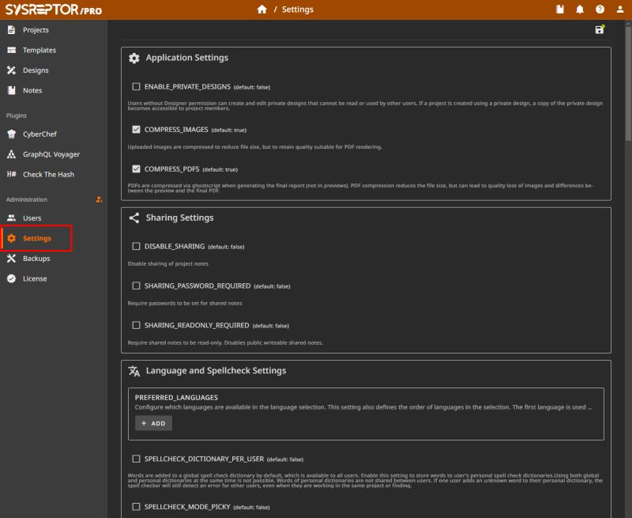

# Edit Settings in the Web UI

You can now modify SysReptor settings using the web interface.
(Almost) everything that had to be configured using the app.env file is now available under the "Settings" menu in the web interface.

Settings from the app.env file are still applied and cannot be modified using the web interface.
If you want to prevent SysReptor superusers to modify settings via the web UI, you can set them in the `app.env` file.

