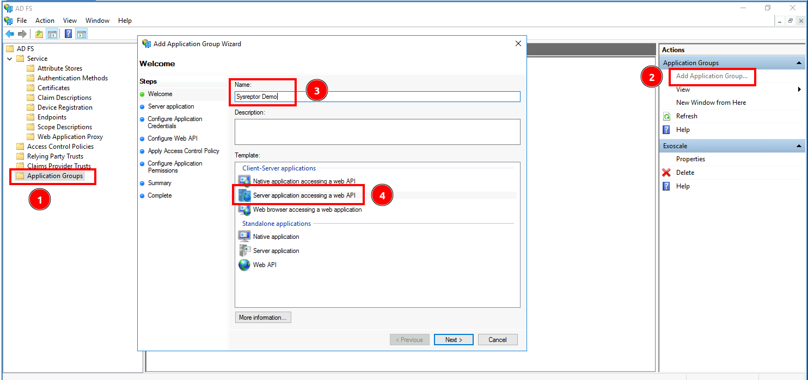
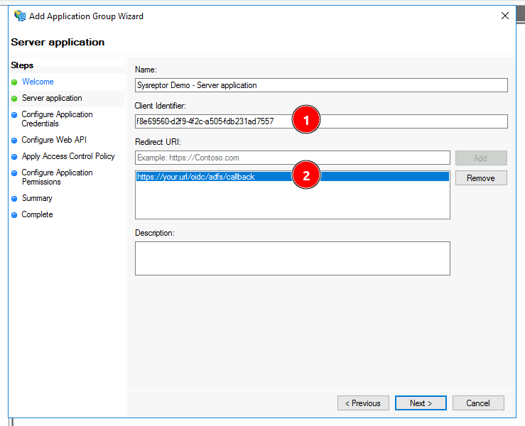
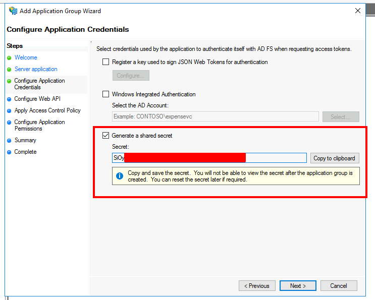
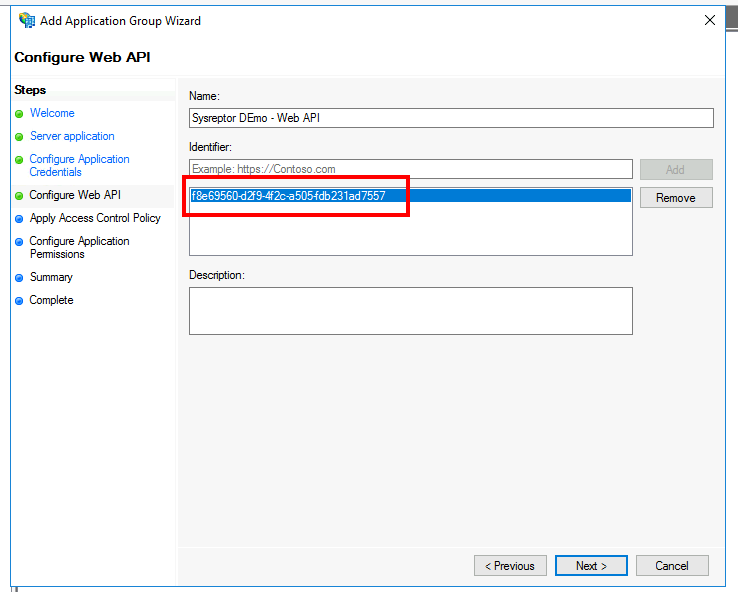
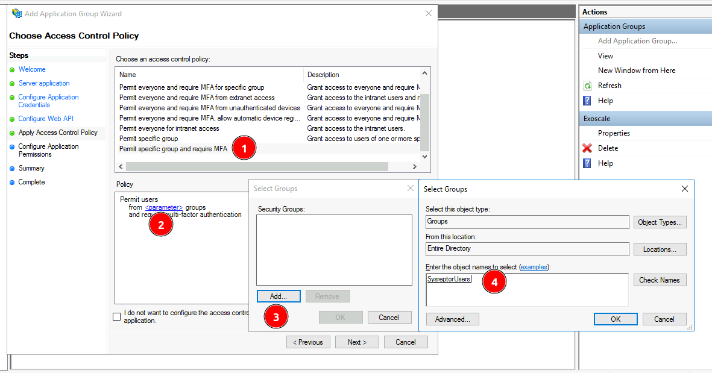
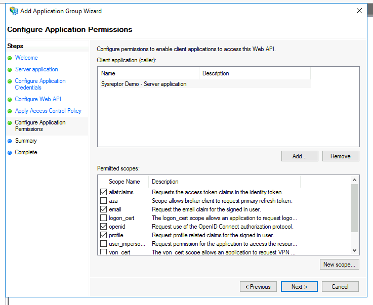
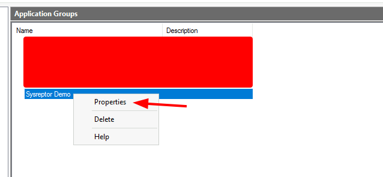
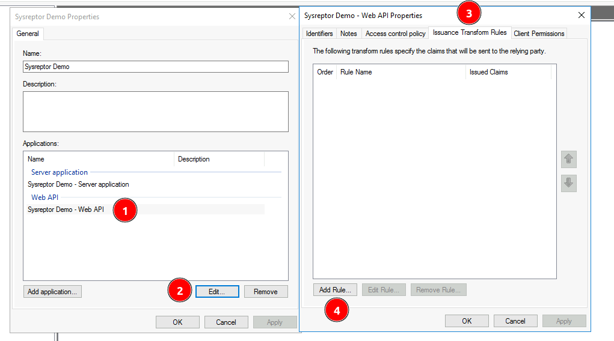
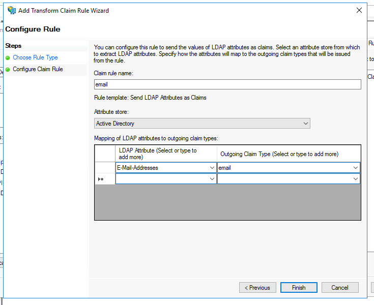

# Microsoft ADFS OIDC Configuration
<span style="color:red;">:octicons-heart-fill-24: Pro only</span>

## Configuration in Microsoft ADFS
1. Open the ADFS Management tool.
2. Register an application group:
    - Go to "Application Groups" (1)
    - Add a new Application Group (2)
    - Enter an Application Group Name (3)
    - Select the Template "Server application accessing a web API" (4)
    - Click "Next"

    

3. Register a server application:
    - Copy the client identifier for later (1)
    - Enter the redirect url of your application in the following format: https://your.url/login/oidc/adfs/callback (2)
    - Click "Next"
    
    

4. Configure Application credentials:
    - Select "Generate a shared secret"
    - As mentioned, copy and save the secret for later.
    - Click "Next"
    
    

5. Configure Web API:
    - Copy the client identifier from the point 3. in the `Identifier` field.
    - Click "Next"
    
    

6. Configure Access Control Policy:
    - Here we will allow a specific group only and require MFA for users (1)
    - Click the `parameter` link in the `Policy` field (2)
    - Add the AD Group you want to add (3 and 4)
    - Click "OK" and "Next"
    
    

7. Configure Application Permissions:
    - In the permitted scope check `allatclaims`, `email`, `openid` and `profile`.
    - Click "Next"
    
    

8. Configure Claim Rules:
    - After creating your application group successfully, right click on your application and click on `Properties`
    - Then Select the "Web API" (1) and click "Edit" (2)
    - In the new window, select the "Issuance Transform Rules" tab (3) and click "Add Rule" (4)
    - Select the rule template "Send LDAP Attributes as Claims"
    - Finally, add a rule named "email" which maps the "E-Mail-Addresses" LDAP Attribute to the claim type "email".
    
    
    
    

You should now have the following values:

* Client ID
* Client secret

## SysReptor Configuration

Create your OIDC configuration for SysReptor...

```json
{
    "adfs": {
        "label": "ADFS",
        "client_id": "<your client_id>",
        "client_secret": "<your_client_secret>",
        "server_metadata_url": "https://adfs.your.domain/adfs/.well-known/openid-configuration",
        "client_kwargs": {
            "scope": "openid profile email",
            "code_challenge_method": "S256"
        },
        "reauth_supported": false
    }
}

```

...and add it to your [application settings](/setup/configuration/#single-sign-on-sso):

```env
OIDC_AUTHLIB_OAUTH_CLIENTS='{"adfs": {"label": "ADFS",...}}'
```

The OIDC client needs to be able to establish a network connection to Microsoft ADFS.
Make sure to not block outgoing traffic.
