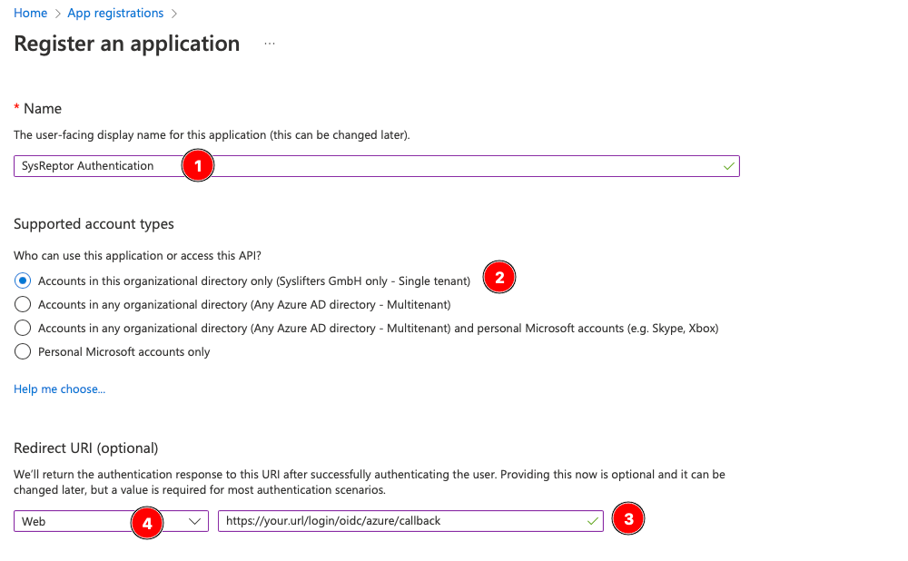
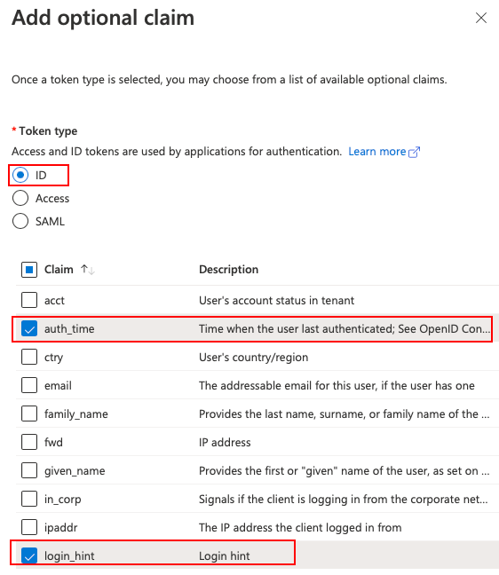

# Microsoft Entra ID OIDC Configuration
<span style="color:red;">:octicons-heart-fill-24: Pro only</span>

## Configuration in Microsoft Entra ID
1. Open [Microsoft Entra Admin Center](https://entra.microsoft.com){ target=_blank }
2. Select Applications -> App registrations -> New registration
3. In following menu: 

    - Enter a Name for your reference (1)
    - Select the types of accounts who are allowed to login (2) - this is the first option "Single tenant" in most cases
    - Enter the redirect url of your application in the following format: https://your.url/login/oidc/azure/callback (3)
    - Select type "Web" for redirect url (4)

    

4. In the newly created "App registration", go to the Token configuration submenu and add the following *optional* claim:
    - TokenType: ID
    - Claims: auth_time, login_hint
    


5. Next go to the "Certificates & Secrets" submenu and add a new client secret with 24 months validity (this is the maximum) and any description.
6. Copy the value of the newly created secret and store it for later use.
7. Finally go to the "Overview" submenu and copy the values *Application (client) ID* and *Directory (tenant) ID*.

You should now have the following values:

* Client ID
* Client secret
* Entra tendant ID


## Cloud Setup
:octicons-cloud-24: Cloud

You are lucky. Just send the values from the previous steps to us and we'll take care :smiling_face_with_3_hearts:


## Self-Hosted Setup
:octicons-server-24: Self-Hosted

The values from the previous steps need to be passed as environment variables to the SysReptor docker container.
You can add them to `<sysreptor-repository>/deploy/app.env`:
```env
OIDC_AZURE_TENANT_ID=<entra tenant id>
OIDC_AZURE_CLIENT_ID=<entra client id>
OIDC_AZURE_CLIENT_SECRET=<entra client secret>
```

The OIDC client needs to be able to establish a network connection to Microsoft Entra ID.
Make sure to not block outgoing traffic.

Restart the docker container by going to `sysreptor/deploy` and:

```shell
docker compose up -d
```