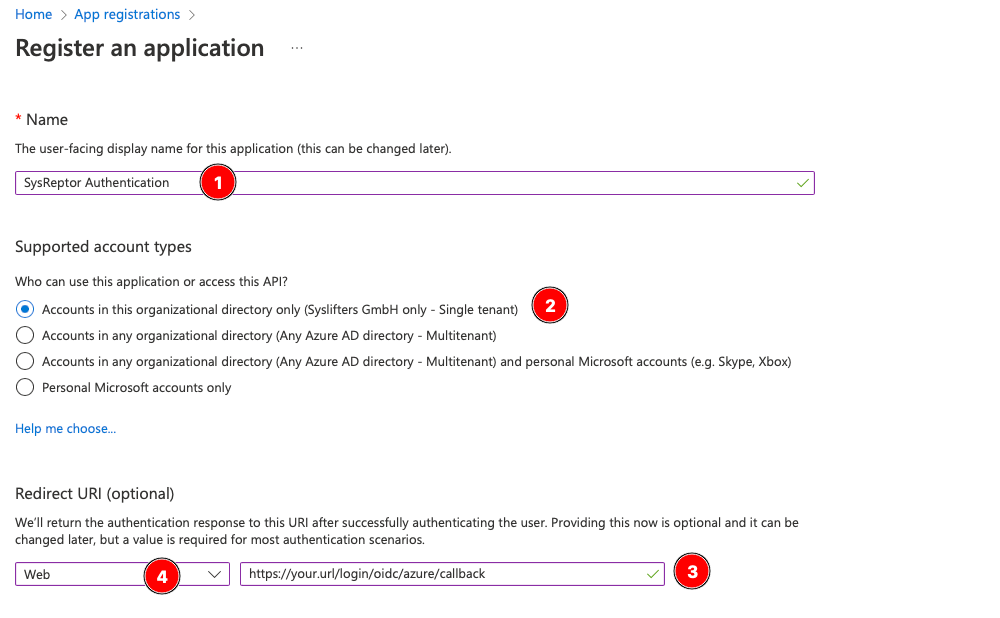
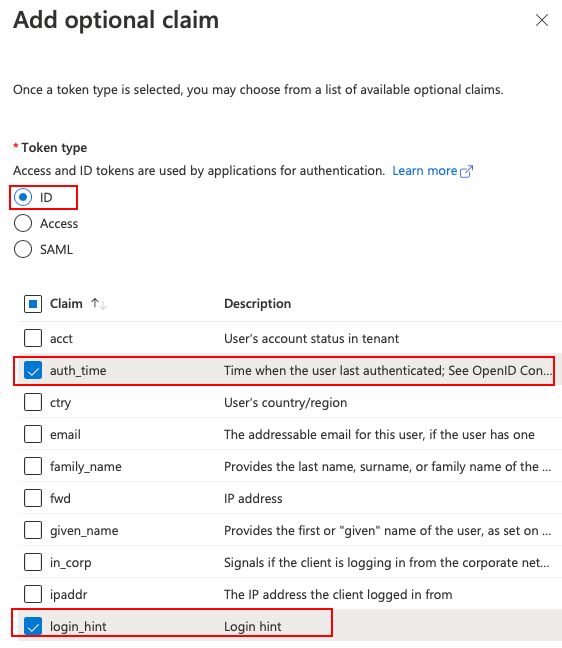

# Microsoft Entra ID OIDC Configuration
<span style="color:red;">:octicons-heart-fill-24: Pro only</span>

## Configuration in Microsoft Entra ID
1. Open [Microsoft Entra Admin Center](https://entra.microsoft.com){ target=_blank }
2. Select Applications -> App registrations -> New registration
3. In following menu: 

    - Enter a Name for your reference (1)
    - Select the types of accounts who are allowed to login (2) - this is the first option "Single tenant" in most cases
    - Enter the redirect url of your application in the following format: https://your.url/login/oidc/entra/callback (3)
    - Select type "Web" for redirect url (4)

    

4. In the newly created "App registration", go to the Token configuration submenu and add the following *optional* claim:
    - TokenType: ID
    - Claims: auth_time, login_hint
    


5. Next go to the "Certificates & Secrets" submenu and add a new client secret with 24 months validity (this is the maximum) and any description.
6. Copy the value of the newly created secret and store it for later use.
7. Finally go to the "Overview" submenu and copy the values *Application (client) ID* and *Directory (tenant) ID*.

You should now have the following values:

* Client ID
* Client secret
* Entra tenant ID


## SysReptor Configuration

Create your OIDC configuration for SysReptor...

```json
{
    "entra": {
        "label": "Microsoft Entra ID",
        "client_id": "<entra client id>",
        "client_secret": "<entra client secret>",
        "server_metadata_url": "https://login.microsoftonline.com/<entra tenant id>/v2.0/.well-known/openid-configuration",
        "client_kwargs": {
            "scope": "openid email profile",
            "code_challenge_method": "S256"
        },
        "reauth_supported": true,
        "user_identifier_claim": "email",
        "require_email_verified": true
    }
}
```

...and add it to your [application settings](/setup/configuration/#single-sign-on-sso) (`OIDC_AUTHLIB_OAUTH_CLIENTS`).

The OIDC client needs to be able to establish a network connection to Microsoft Entra ID.
Make sure to not block outgoing traffic.

Other JSON fields, `user_identifier_claim`, and general SSO limitations are covered in [Generic OIDC configuration](oidc-generic.md#sysreptor-configuration) and [Limitations](oidc-generic.md#limitations).

### Entra ID: `email_verified`

Some Entra ID configurations omit `email_verified` or return `email_verified=false`. See [Verified Emails](oidc-generic.md#verified-emails) and adjust `require_email_verified` only if you understand the trade-off.
