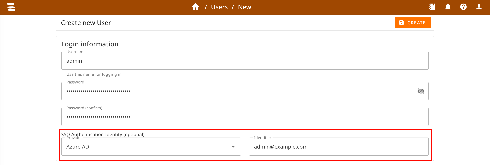

# SSO Setup with OIDC
:octicons-heart-fill-24: Pro only

1. Configure your Identity Provider (IDP) and add configuration details to your [application settings](/setup/configuration/#single-sign-on-sso).
    * [Microsoft Entra ID](../users/oidc-entra-id.md)
    * [Google Workplace/Google Identity](../users/oidc-google.md)
    * [Keycloak](../users/oidc-keycloak.md)
    * [Generic OIDC setup](../users/oidc-generic.md)
    * Need documentation for another IDP? Drop us a message at [GitHub Discussions](https://github.com/Syslifters/sysreptor/discussions/categories/ideas){ target=_blank }!
2. Set up local users:

    a. Create user that should use SSO  
    b. Go to "Identities"  
    c. Add identity ("Add")  
    d. Select Provider and enter the SSO identifier provided by your IdP (default: `email`, configurable via `user_identifier_claim`). Matching is case-sensitive and must use the same spelling and casing as the IdP returns.

The user can now log in via their IdP.
