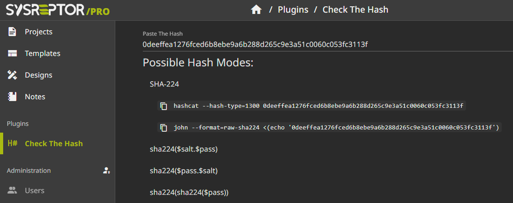

# Check the Hash
Identify possible hash types of a string.

Add `checkthehash` to the `ENABLED_PLUGINS` variable in your `app.env` and restart your containers using `docker compose up -d` from the `deploy` directory.

```
ENABLED_PLUGINS="checkthehash"
```

