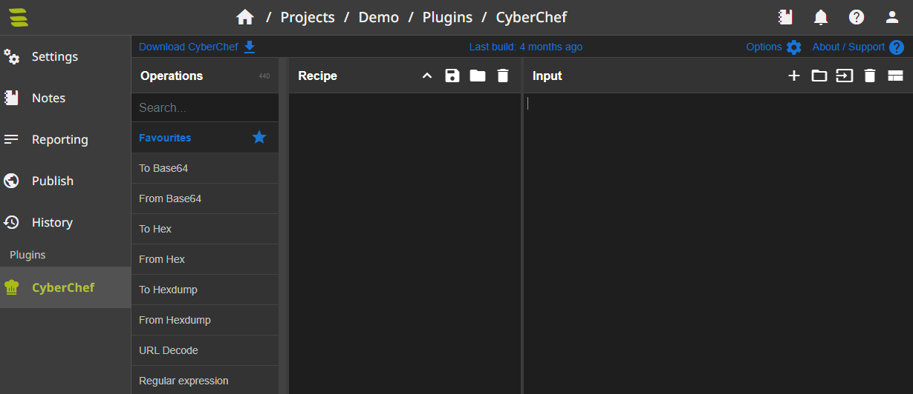

# CyberChef Plugin
Add CyberChef to SysReptor.

Add cyberchef to the `ENABLED_PLUGINS` variable in your `app.env` and restart your containers using `docker compose up -d` from the `deploy` directory.

```
ENABLED_PLUGINS="cyberchef"
```

