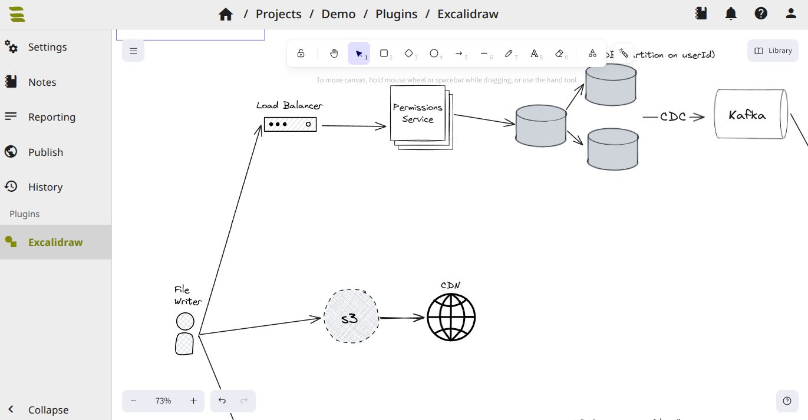

# Excalidraw Plugin
Add Excalidraw to SysReptor.

Add `excalidraw` to the `ENABLED_PLUGINS` variable in your `app.env` and restart your containers using `docker compose up -d` from the `deploy` directory.

```
ENABLED_PLUGINS="excalidraw"
```

