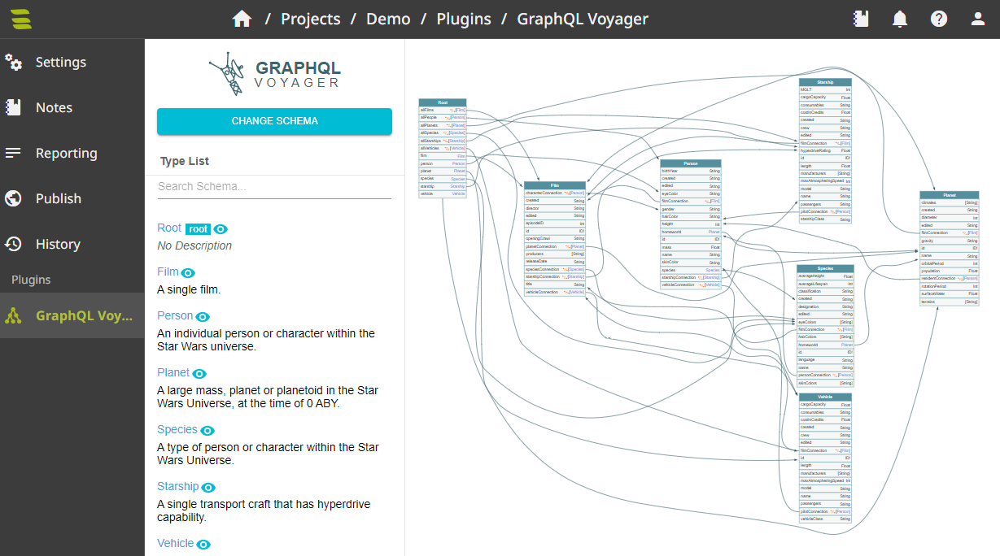

# GraphQL Voyager Plugin
Add GraphQL Voyager to SysReptor.

Add `graphqlvoyager` to the `ENABLED_PLUGINS` variable in your `app.env` and restart your containers using `docker compose up -d` from the `deploy` directory.

```
ENABLED_PLUGINS="graphqlvoyager"
```

