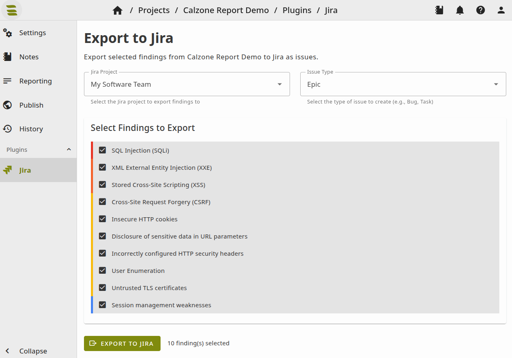

# Jira Plugin

Export findings from SysReptor to Atlassian Jira as issues. This plugin creates and updates Jira issues directly from your security assessment findings, enabling seamless integration with issue tracking workflows.

Features:
- **Export Findings to Jira**: Convert SysReptor findings into Jira issues
- **Finding Selection**: Choose specific findings to export
- **Project Selection**: Choose which Jira project to export findings to
- **Issue Type Selection**: Select the appropriate issue type (Bug, Task, etc.)
- **Smart Updates**: Automatically detects existing issues and updates them instead of creating duplicates
- **Image Attachments**: Automatically uploads referenced images as Jira attachments


## Installation
Add `jira` to the `ENABLED_PLUGINS` variable in your `app.env` and restart your containers using `docker compose up -d` from the `deploy` directory.

```shell
ENABLED_PLUGINS="jira"
```

## Configuration
After enabling the plugin, configure your Jira connection in the SysReptor admin interface under **Plugins** → **Jira Export Plugin**:

1. **Jira URL**: Base URL of your Jira instance (e.g., `https://your-company.atlassian.net`)
2. **Jira Username**: Username for authentication (usually your email for Jira Cloud)
3. **Jira API Token**: API token for authentication




