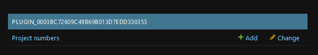
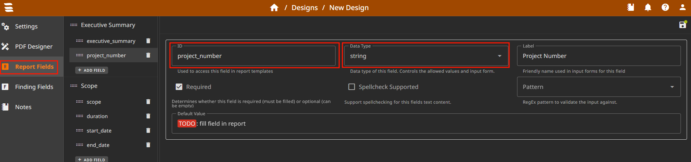
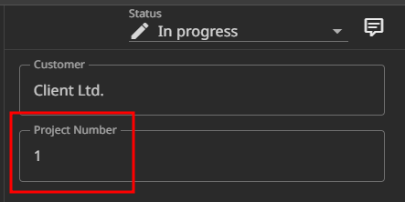
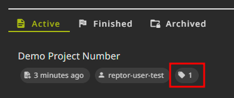

---
title: Project Number Plugin
author: Florian Lotz
date: 28.11.2024
...

# Project Number Plugin

This pluign adds sequential project numbers to newly created projects. The project number formatting can be [customized using Django Templates](#customizations). The project number will only be set if the project is newly created (not restored, imported or copied) and if the report field with "project_number" exists in the Design. You can use a [different field ID](#field-id) as your project number.

## Setup Instructions

1. Enable the plugin in your app.env `ENABLED_PLUGINS=projectnumber`
2. Restart SysReptor (run `docker compose up -d` from the `deploy` directory).
3. Check if you see a new model in you admin interface named "Project numbers". If it is there, the plugin was installed successfully. 

 
## Usage Instructions

1. Add the report field "project_number" with data type "string".

2. Use this Design to create a new project.
3. You should now see the project number in the report field and as a project tag. 

## Customizations

### Templates
Using the variable `PLUGIN_PROJECTNUMBER_TEMPLATE` you can use [Django Templates](https://docs.djangoproject.com/en/stable/topics/templates/) to customize the value of the project number. In the template, you can use the variables `{{project_number}}` and `{{datetime}}`, and built-in Django template tags (like ``, ``).

Here are some examples:

- Four-digit year, project number with trailing zeros, e.g., **2024-0001**:

  `-{{project_number|stringformat:'04d'}}`
- Static prefix "P" with two-digit year, project number with trailing zeros, e.g., **P24-0001**:
  
  `P-{{project_number|stringformat:'04d'}}`

- Year-Month-Day, project number and static suffix "A", e.g., **2024-11-01-1-A**:

  `---{{project_number}}-A`

- Project number and random number between 10 and 77, e.g., **1-17**:

  `{{project_number}}`

### Field ID

By default, the field id is "project_number". This can be changed using the `PLUGIN_PROJECTNUMBER_FIELD_ID` environment variable.

Add this setting you your app.env and restart your Docker container (using `docker compose up -d` from the `deploy` directory), e.g., `PLUGIN_PROJECTNUMBER_FIELD_ID=project_id`.
