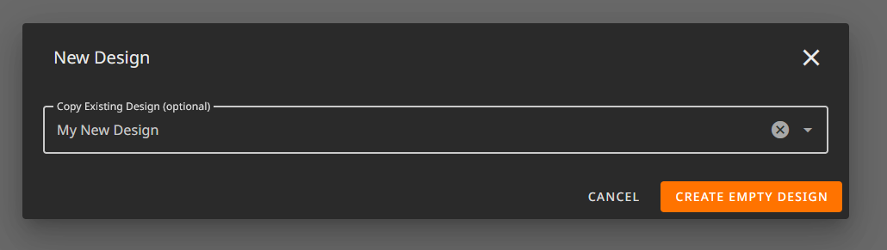
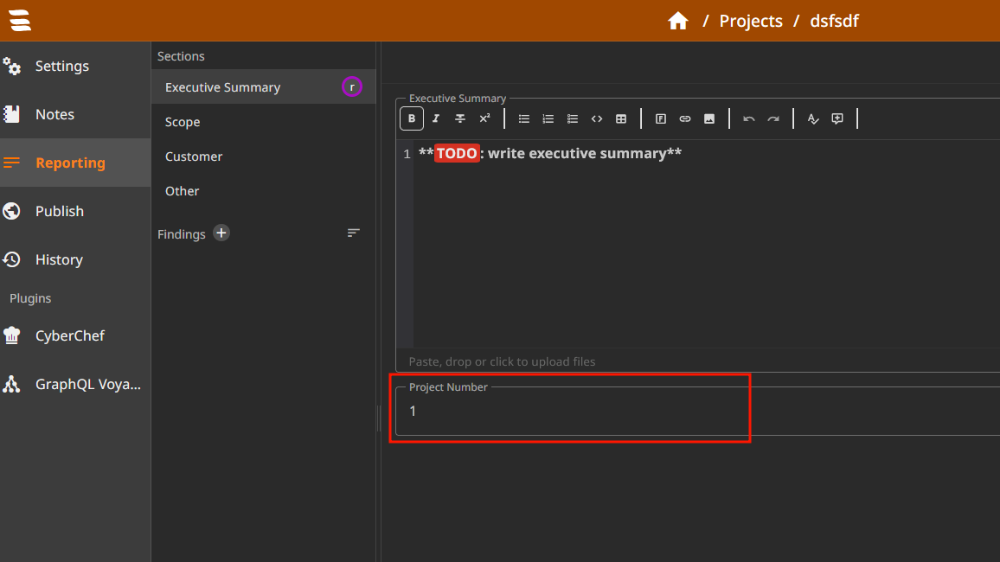

---
title: Project Number Plugin
author: Florian Lotz
date: 28.11.2024
...

# Project Number Plugin

This pluigin adds functionality for a sequential project number for newly created projects. The String value of the project number can be customized using Django Templates. The project number will only be set if the project is newly created (not restored, imported or copied) and if the report field with "project_number" is configured in the Design. The report field id can be changed see [Field ID](#field-id)

## Setup Instructions

1. Enable the Plugin in your app.env `ENABLED_PLUGINS=projectnumber`
2. Restart sysreptor.
3. Check if you see a new Model in you Admin Interface called Project Numbers. If its there the plugin should be installed successfully. 

 
## Usage Instructions

1. Create/edit a Design

2. Go to Report Fields and add a new Field with the ID "project_number" and Data Type of string or number to a section.

3. Using this Design, create a new Project.
4. Go to the newly created project and check in the section you added the Project Number field. It should contain the current Project Number. 

## Customizations

### Templates
Using the variable `PLUGIN_PROJECTNUMBER_TEMPLATE` you can use [Django Templates](https://docs.djangoproject.com/en/5.1/topics/templates/) to customize the value of the project number. In the template you can use `"{{project_number}}"` and `"{{datetime}}"`, these variables will be filled in by the plugin.

Here are some examples:
- P24-0001: P<year 2 digit>-<projectnumber 4 digit>
  
  `"P-{{project_number|stringformat:'04d'}}"`
- 2024-0001: <year 4 digit>-<projectnumber 4 digit>

  `"-{{project_number|stringformat:'04d'}}"`
- Prefix-24110001-Suffix: Prefix-<year 2 digit><month 2 digit><number 2 digit>-Suffix

  `"Prefix-{{project_number|stringformat:'04d'}}-Suffix"`

- P000117: P<project_number 4 digit><random suffix between 5 and 23, 2 digit>

  `"P{{ project_number|stringformat:'04d' }}"`

- 1001: 1000 + <projectnumber>

  `"{{ 1000|add:project_number }}"`

### Field ID

By default the field id is "project_number". This can be changed using the `PLUGIN_PROJECTNUMBER_FIELD_ID` environment variable.

Here is an example: `PLUGIN_PROJECTNUMBER_FIELD_ID=project_id`

## Troubleshooting

### Docker Compose Unexpected Characters

When using docker compose for development you might run into issues due to unexpected characters. This is likely due to a double quote to single quote mix up.

Here is an example that would cause such issues: 

`"P-{{project_number|stringformat:"04d"}}"`

To fix this you would need to replace all double quotes within the outer ones with single quotes like: 

`"P-{{project_number|stringformat:'04d'}}"`

or

`'P-{{project_number|stringformat:"04d"}}'`